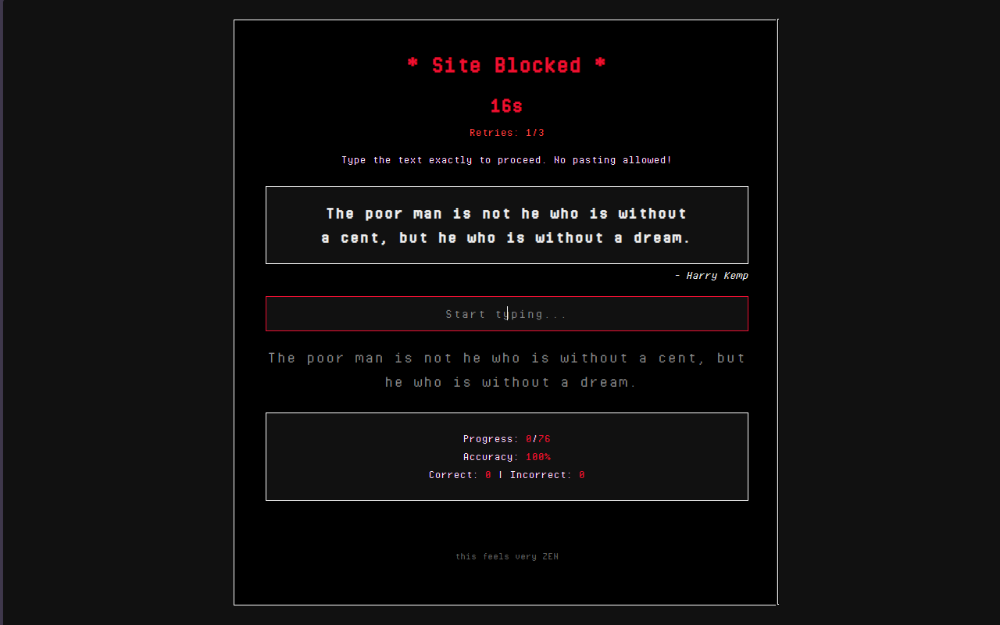
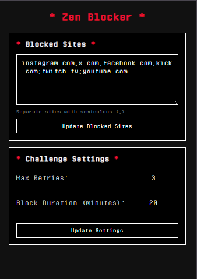

<div align="center">
	
	<h1>Zen Blocker</h1>
	<p>A <b>Website Blocker</b> extension for your browser!</p>
</div>

<div align="center">
	<sub>A little browser extension built with ❤︎ by <a href="https://github.com/ssstockle">ssstockle</a></sub>
</div>

<hr />

## Overview

Zen Blocker is a Chrome extension designed to help you stay focused by blocking distracting websites. When you try to
visit a blocked site, you'll be redirected to a ~calming~ blocked page with a mindful quote to help you resist the urge
to
doomscroll.



_How calming is that?_

## Perfect for anyone who wants to:

- Break the doomscrolling habit
- Stay focused during work or study sessions
- Build healthier browsing habits

## Features



- Block any website you want
- ~Calming~ blocked page with mindful quotes
- Easy to add or remove sites from your block list
- Works instantly after adding sites

> [!WARNING]  
> If you fail three times, you will get blocked for 20 mins by default, not only for the page you were trying to access,
> but for
> all blocked pages. This is to help you build discipline and resist the urge to visit distracting sites (I'm talking to
> myself here).
> Go on, have it for ~
> free~: [Chrome Web Store](https://chrome.google.com/webstore/detail/zen-blocker/ljdobmomdgdljniojadhoplhkpialdid)

## Installation

### Chrome and Chromium-based browsers

#### Install from source

> [!NOTE]
> I actually paid $5 just to have this extension published on the Chrome Web Store (_small update: they rejected it because of permissions, 
> I didn't re-apply, so go and grab your free .zip here for now hehe_), you ~~can~~ get it from there if you
> want to make Google happy, but if you want to avoid that, just install it from source following the steps below.

1. Download the .zip from the releases tab or clone this repository.
2. Open Chrome and navigate to `chrome://extensions/` (or your Chromium-based browser's extensions page)
3. Enable "Developer mode" in the top right corner
4. Click "Load unpacked" and select the extension folder
5. The extension icon will appear in your toolbar

## Usage

1. Click the Zen Blocker icon in your browser toolbar
2. Add websites you want to block (e.g., `twitter.com`, `reddit.com`)
3. Try to visit those sites and experience zen instead

#### Example
```plaintext
x.com;instagram.com;twitter.com;youtube.com;twitch.tv;kick.com;tiktok.com
```

## Contribute

- Haven't really thought about this yet, I actually made this for myself, but ended up thinking others might find it
  useful too. If you want to contribute, feel free to open an issue or a pull request, if not; no worries, you can
  always fine-tune it for your own needs!
